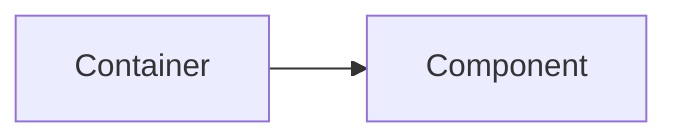
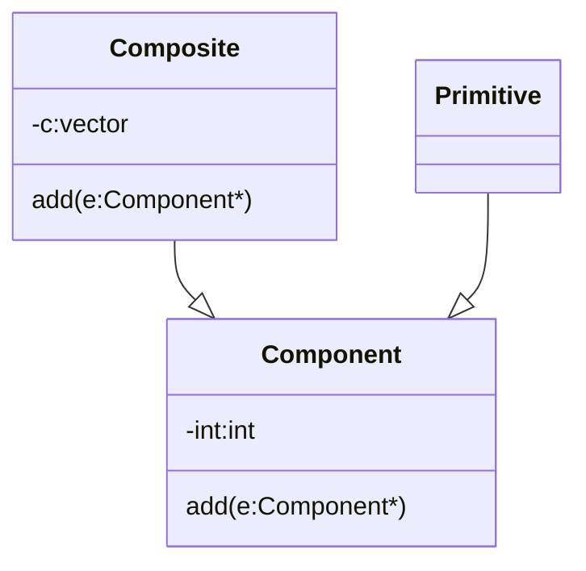
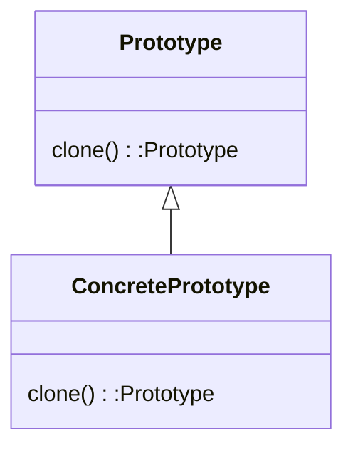

# C++ OOD & OOP

## 预备知识：UML类图

- \+ : public
- \- : private
- \# : protected
- _ : static

## 复合 Composition, 表示 has-a

```cpp
Template <class T>
class queue{
    ...
protected:
    deque<T> c; // 底层容器

public:
    ...
    bool empty() const { return c.empty(); }
    size_type size() const { return c.size(); }
    reference front() { return c.front(); }
    const_reference front() const { return c.front(); }
    reference back() { return c.back(); }
    const_reference back() const { return c.back(); }
    void push(const value_type& x) { c.push_back(x); }
    void pop() { c.pop_front(); }
    ...
};
```


### Adapter

```cpp
template <class T, class Sequence = deque<T> >
class queue {
    ...
protected:
    Sequence c; // 底层容器
    ...
};
```

Adapter 适配器，是一种特殊的复合，它的目的是为了改变接口，而不是改变实现。

### Composition 关系下的构造和析构



```cpp
class Container{
    Component c;
public:
    Container(...): c() {}
    ~Container() {}
};
```

- 构造由内而外
Container 的构造函数先调用 Component 的default构造函数，再调用自己的构造函数。
- 析构由外而内
Container 的析构函数先调用自己的析构函数，再调用 Component 的析构函数。

如何理解由内而外，由外而内？
我理解是类似一个栈，**创建一个Container对象时，先把Component对象压入栈，再把Container对象压入栈，析构时，先把Container对象弹出栈，再把Component对象弹出栈。**

## Delegation 委托，Composition by Reference

```c++
class StringRep;
class String{
public:
    String();
    String(const char* cstr);
    String(const String& rhs);
    String& operator=(const String& rhs);
    ~String();
...
private:
    StringRep* rep; // pimpl
};


class StringRep{
public:
    StringRep(const char* cstr);
    StringRep(const StringRep& rhs);
    StringRep& operator=(const StringRep& rhs);
    ~StringRep();
    char* get_cstr() const;
```

- 委托是指一个对象将自己的某些职责委托给另一个对象来完成，用指针或引用来表示被委托的对象。
- pimpl 是一种实现技术，它的目的是为了隐藏实现细节，而不是为了改变接口。
- **编译防火墙**，编译器不会检查 StringRep 的实现，只会检查 String 的接口。

## Inheritance 继承, 表示 is-a

```c++
struct _List_node_base {
    _List_node_base* _M_next;
    _List_node_base* _M_prev;
};

template <class _Tp>
struct _List_node : public _List_node_base {
    _Tp _M_data;
};
```

- 继承的语法：`class Derived: public Base`
- 父类的数据是被子类完整继承的。
- 类似于Composition关系下的析构和构造，继承关系下的析构和构造也是由内而外，由外而内。
  - 构造由内而外
  Derived 的构造函数先调用 Base 的default构造函数，再调用自己的构造函数。
  - 析构由外而内
  Derived 的析构函数先调用自己的析构函数，再调用 Base 的析构函数。

### Inheritance with virtual function

- non-virtual function
  - 非虚函数，不会发生动态绑定，调用的是基类的函数， 不希望子类重新定义的函数。
- virtual function
  - 虚函数，会发生动态绑定，调用的是派生类的函数。
- pure virtual function
  - 纯虚函数，没有函数体，只有函数原型，派生类必须实现它。

```c++
class Shape {
public:
    virtual void draw() const = 0; // 纯虚函数
    virtual void error(const std::string& msg); // 虚函数
    int objectID() const; // 非虚函数
    ...
};

class Rectangle: public Shape {...};
class Circle: public Shape {...};
```

### Inheritance+Composition关系下的构造和析构

```c++
#include <iostream>
using namespace std;
class A{
 public:
  A(){
   cout<<"A constructor"<<endl;
  }
  ~A(){
   cout<<"A destructor"<<endl;
  }
};

class C{
 public:
  C(){
   cout<<"C dectructor"<<endl;
   
  }
  ~C(){
   cout<<"C destructor"<<endl;
  }

};


class B:public A{
 public:
  B():c(){
   cout<<"B constructor"<<endl;
  }
  ~B(){
   cout<<"B destructor"<<endl;
  }
 private:
  C c;

};

int main(){
 B b;
}


```

输出结果：

```c++
A constructor
C dectructor
B constructor
B destructor
C destructor
A destructor
```

上述结果说明，**先调用基类的构造函数，再调用Composition关系下的构造函数，最后调用自己的构造函数。析构函数的调用顺序与构造函数相反**。

## 委托设计模式

设计一个文件系统

分析系统的功能：

1. 由文件夹和文件构成
2. 文件夹中可以有文件，也可以有文件夹

- 要写出一个代表文件的类（Primitive）
- 要写出一个代表文件夹的类（Composite），可以容纳很多文件和文件夹



上图中，为什么vector中存放的是Component*，而不是Composite* 或者Primitive*呢？因为我们希望vector中存放的是Component的所有子类，这样就可以存放Composite和Primitive。
而且，vector中存放的应该是一样大小的数据，所以不能存放Composite和Primitive，而应该存放指针。

### Prototype

- 问题描述：如何创建未来可能需要的对象？
- 解决方案：使用原型模式：子类自己创建自己的对象，而不是由父类创建。



```c++
#include <iostream>
enum{
LSAT, SP    
};
class Image{
public:
    virtual void draw() = 0;
    static Image* findAndClone(int type);
}

class LandSatImage: public Image{
public:
    void draw(){
        cout<<"LandSatImage"<<endl;
    }
    Image* clone(){
        return new LandSatImage;
    }
}

class SPImage: public Image{
public:
    void draw(){
        cout<<"SPImage"<<endl;
    }
    Image* clone(){
        return new SPImage;
    }
}

